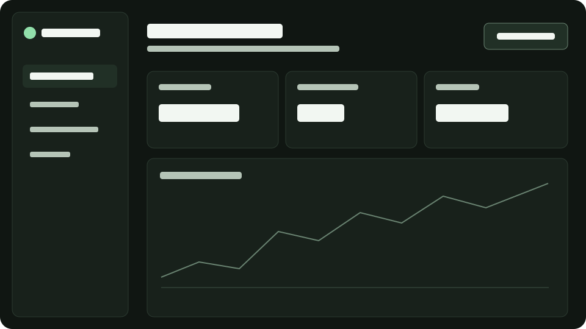

# Direção visual para dashboards Miuly

**Pesquisa verificada em 24/09/2026.** Esta é uma proposta de design para dashboards do frontend Angular 22, que está em evolução e já inclui telas de login/cadastro em desenvolvimento. Não cria requisitos funcionais para finanças, tarefas, calendário ou identidade. A arquitetura vigente mantém base global em `frontend/src/styles.scss` e estilos locais junto de cada componente; veja [arquitetura do frontend](../frontend-architecture.md).

## Decisões aplicáveis

1. **Escuro como padrão:** fundo `#101216`, superfície `#191d23`, texto principal `#f6f7f9`. Usar o branco para texto e controles de maior prioridade; evitar grandes blocos brancos sobre fundo preto. Cor de destaque proposta: `#7cc4ff`. São valores iniciais, sujeitos à validação visual no produto, não cores oficiais preexistentes.
2. **Hierarquia calma:** título da página, resumo, ação principal e conteúdo em ordem de leitura. Cabeçalho e navegação lateral somente quando houver função. Limitar a largura de leitura a `80rem` e usar espaço entre grupos antes de acrescentar cartões. O [Primer Layout](https://primer.style/product/getting-started/foundations/layout/) recomenda regiões claras e simplificação de colunas em telas estreitas.
3. **Bordas finas:** 1 px para separar superfícies; `#303843` é divisória decorativa, não o único contorno de um controle. Para campo cujo contorno identifica a área clicável, usar `#687481` sobre `#191d23` (contraste calculado de ~3,55:1) ou outra combinação aferida. Evitar sombra e gradiente como separadores principais.
4. **Tipografia:** fonte de sistema, título entre `1.5rem` e `2rem`, corpo `1rem`, metadados no mínimo `0.875rem` quando legíveis. Usar tabulares (`font-variant-numeric: tabular-nums`) em valores alinhados. Reservar negrito para títulos, totais e ação principal.
5. **Movimento:** transições discretas de cor ou opacidade, `120–180ms`, sem movimento contínuo em dados ou painéis. Desabilitar transições e animações não essenciais em `prefers-reduced-motion: reduce` ([MDN](https://developer.mozilla.org/en-US/docs/Web/CSS/Reference/At-rules/%40media/prefers-reduced-motion)).
6. **Tokens semânticos:** nomes como `--miuly-surface` e `--miuly-text-muted` em vez de `--gray-900`. [Primer Color Usage](https://primer.style/product/getting-started/foundations/color-usage/) usa tokens por função para manter coerência entre estados e temas. Sass `@use` serve para mixins e constantes de compilação, enquanto propriedades CSS permitem trocar valores em tempo de execução ([Sass](https://sass-lang.com/documentation/at-rules/use/)).

## Referências visuais e decisão de uso

| Fonte primária | O que observar | Aplicação no Miuly | Imagem local |
| --- | --- | --- | --- |
| [Orca IDE — site oficial](https://www.onorca.dev/) | Áreas de trabalho em painéis, navegação densa, superfícies escuras e divisórias discretas | Manter contexto e ações visíveis sem sobrecarregar o painel principal. É inspiração de composição, não identidade visual a copiar. | Capturas oficiais não foram copiadas: a página não oferece licença de redistribuição explícita para elas. |
| [Primer — Layout](https://primer.style/product/getting-started/foundations/layout/) e [PageLayout](https://primer.style/product/components/page-layout/) | Cabeçalho, conteúdo, painel auxiliar e separação por linhas | Usar painel lateral só com finalidade clara; empilhar em telas estreitas. | Não copiadas; licença das imagens não foi confirmada. |
| [Primer — Color usage](https://primer.style/product/getting-started/foundations/color-usage/) | Tema escuro com cores semânticas | Mapear texto, superfície, borda e estados por função. | Não copiadas; licença das imagens não foi confirmada. |

Os exemplos de interface no site Orca são materiais promocionais e podem mudar. Registrar a URL e a data, sem extrair cores exatas por captura. A ilustração [`wireframe-dashboard.svg`](wireframe-dashboard.svg) é desenho **original desta pesquisa**, inspirado apenas na ideia geral de painéis; não contém imagem nem marca de terceiros. Pode ser usada no projeto Miuly, sujeita à licença do repositório.

## Responsividade

- Projetar primeiro para 320 CSS px e verificar reflow sem rolagem horizontal da página; tabelas e gráficos complexos podem ter rolagem própria, com indicação visível. Isso segue [WCAG 1.4.10](https://www.w3.org/WAI/WCAG21/Understanding/reflow).
- Em `<= 48rem`, transformar duas colunas em uma; navegação lateral vira menu acionável com rótulo. Não ocultar conteúdo essencial apenas com `display: none` ([Primer Layout](https://primer.style/product/getting-started/foundations/layout/)).
- Cards usam `minmax(min(100%, 16rem), 1fr)` para evitar overflow. Texto longo recebe `overflow-wrap: anywhere` apenas quando necessário; números não podem ser cortados sem alternativa de leitura.
- Testar 320, 375, 768, 1280 e 1440 CSS px, zoom 200% e texto ampliado. A escolha de breakpoint deve seguir a largura real do conteúdo.

## Acessibilidade e estados

- **Contraste:** texto normal >= 4,5:1, texto grande >= 3:1 e indicadores visuais essenciais de controle/estado >= 3:1, conforme [WCAG 2.2](https://www.w3.org/TR/wcag/). Os pares propostos foram calculados: `#f6f7f9`/`#101216` ~17,49:1, `#aeb7c2`/`#191d23` ~8,34:1, `#7cc4ff`/`#191d23` ~9,02:1, `#687481`/`#191d23` ~3,55:1. Recalcular quando uma cor mudar.
- **Foco:** aplicar `:focus-visible` com contorno sólido de 2 px e afastamento de 2 px; preservar a visibilidade com cabeçalhos fixos e rolagem. [WCAG 2.4.11](https://www.w3.org/WAI/standards-guidelines/wcag/new-in-22/) exige que foco não fique totalmente oculto; [WCAG 2.4.13](https://www.w3.org/WAI/WCAG22/Understanding/focus-appearance) é nível AAA e orienta o tamanho do indicador. Nunca usar `outline: none` sem substituto.
- **Alvos:** preferir área interativa >= 44×44 CSS px no móvel; o mínimo do [WCAG 2.5.8 AA](https://www.w3.org/WAI/WCAG22/Understanding/target-size-minimum) é 24×24 CSS px ou uma exceção aplicável. Ícone sozinho precisa de nome acessível.
- **Loading:** reservar altura da região para evitar salto; mostrar texto “Carregando…” em `role="status"` ou região `aria-live="polite"`. Skeleton é decorativo; não animar sem fim em movimento reduzido. Desabilitar só a ação que não pode ser repetida; manter navegação disponível.
- **Vazio:** diferenciar “sem dados” de erro e carregamento; dizer qual filtro ou período está ativo e oferecer uma ação pertinente quando existir.
- **Erro:** mensagem concreta, sem sumir automaticamente; manter dados já exibidos quando possível e incluir botão “Tentar novamente”. Usar `role="alert"` somente para erro urgente, pois interrompe a leitura ([MDN](https://developer.mozilla.org/en-US/docs/Web/Accessibility/ARIA/Reference/Roles/alert_role)). Para mensagens ordinárias, `role="status"` ([W3C](https://www.w3.org/WAI/WCAG21/Techniques/aria/ARIA22)).
- **Seleção e dados:** não depender só da cor; combinar texto, ícone ou padrão. Gráficos precisam de título e resumo textual dos valores principais. Definir estados hover, foco, ativo, desabilitado, loading, vazio e erro antes de aprovar um componente.

## Bons e maus exemplos

| Fazer | Evitar | Motivo |
| --- | --- | --- |
| Um título, resumo curto e ação principal identificável | Cinco cartões com igual peso visual e ações concorrentes | Leitura e prioridade ficam claras. |
| Divisória sutil entre regiões e contorno contrastante em campos | Usar o mesmo cinza escuro em todas as bordas | Campo precisa ser percebido como controle. |
| Botão com texto “Atualizar dados” e foco visível | Ícone sem rótulo e `outline: none` | Navegação por teclado e leitor de tela. |
| Região de conteúdo estável com `Carregando…`, depois dados ou erro | Spinner isolado que substitui a página e nunca explica falha | Evita salto e estados ambíguos. |
| Cards fluídos e tabela com rolagem local identificada | `width: 1200px` na página toda | Evita overflow em 320 CSS px. |

## Exemplo executável de Sass

O arquivo [`exemplo-dashboard.scss`](exemplo-dashboard.scss) é um **trecho de referência**, não conectado ao build. Ele contém tokens, grid fluído, foco, estados e movimento reduzido. Copiar apenas após adequar aos componentes existentes. Um HTML mínimo para visualizar o exemplo também está em [`exemplo-dashboard.html`](exemplo-dashboard.html); nenhum deles integra o aplicativo.

## Checklist de prevenção de bugs de UI

- [ ] Tela funciona com strings longas, valor zero, erro de rede, lista vazia e loading tardio.
- [ ] Não há overflow horizontal da página em 320 CSS px e zoom 200%; tabelas têm região de rolagem própria.
- [ ] Foco percorre controles em ordem lógica, aparece inteiro e volta ao acionador ao fechar modal/menu.
- [ ] Loading/erro/vazio são distinguíveis em texto; requisição repetida não duplica ação.
- [ ] Cores contrastam nos estados normal, hover, foco, desabilitado e em dados de gráficos.
- [ ] Mudança de tema ou estado não introduz layout shift, flash de cor ou transição quando movimento reduzido.
- [ ] Campos e filtros preservam valor ao receber erro; ação de tentar novamente é alcançável por teclado.
- [ ] Valores monetários têm unidade, separadores e sinal claros; não dependem apenas de cor para positivo/negativo.
